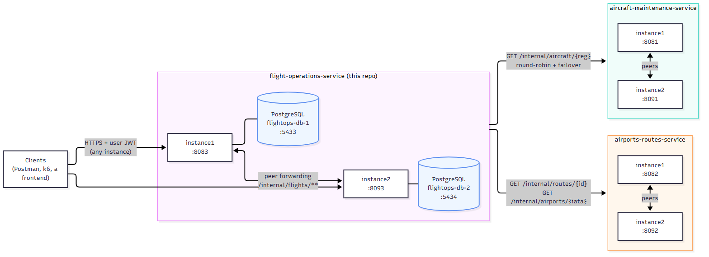
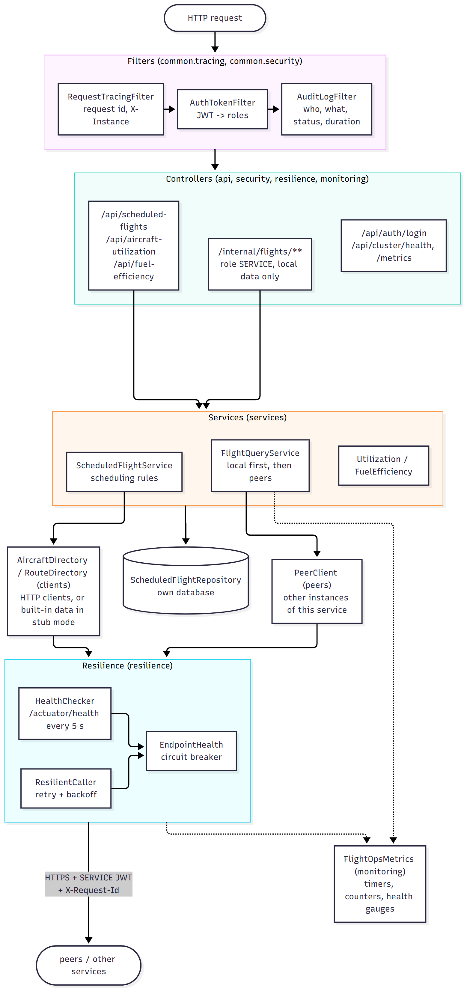
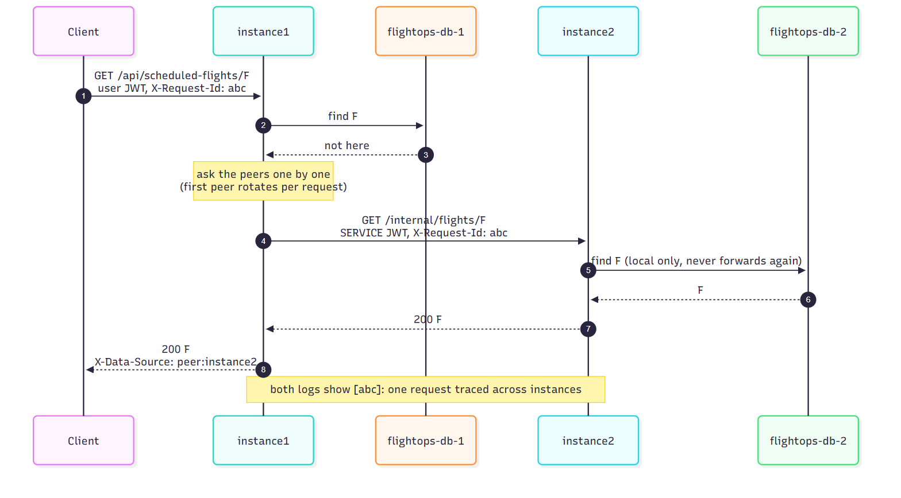
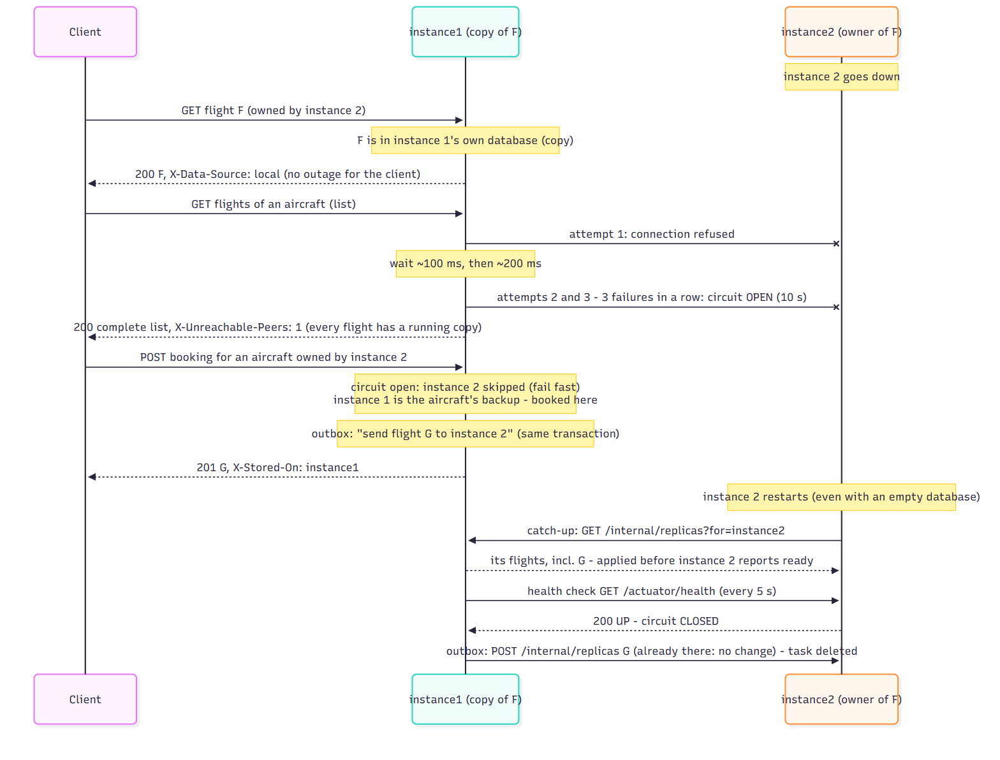
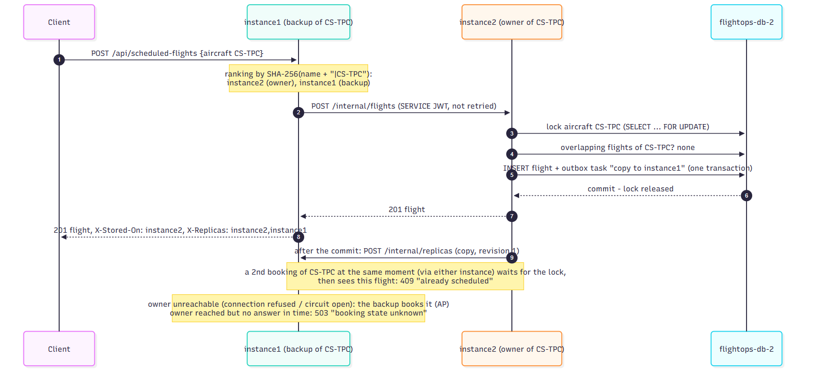
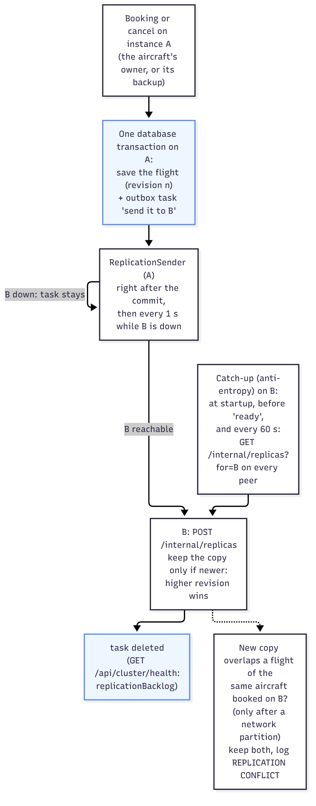

# Flight Operations – architecture notes

Contents: [System architecture (p.20)](#system-architecture-pl3-p20) · [Performance (p.21)](#performance-pl3-p21) · [Consistency model](#consistency-model) · [Horizontal scaling](#horizontal-scaling)

## System architecture (PL3 p.20)

Three components, each running as **2 instances** with their **own database**. Instances of the same component
forward GET requests to each other (peer forwarding); components call each other over HTTPS with a service token.
Flight Operations keeps every flight on **two instances** (replication), so the data of a stopped instance stays
available.
Diagram sources: `docs/diagrams/*.mmd` (Mermaid); images regenerated with
`npx @mermaid-js/mermaid-cli -i <file>.mmd -o <file>.png -b white -s 2`.

### 1. The system



### 2. Inside one instance



### 3. HTTP GET forwarding (PL3 p.11)



### 4. Failure and automatic recovery (PL3 p.14)



### 5. A booking is made on the aircraft's owner and copied to its backup (P1 p.15, sharding by registration)



### 6. Replication: how a change reaches every copy (P1 p.11, eventual consistency)



### Key architectural benefits (PL3 p.20)

| Benefit | How this system provides it | Limit (honest) |
|---|---|---|
| **High availability**: the service continues if instances fail | 2 instances per component behind a load balancer (nginx: health-aware, fails over to the other instance); any instance answers any request (stateless JWT); every flight kept on 2 instances, so a failed instance's data is still served from its copies; retries, circuit breaker; Docker restarts an instance whose process stops; a restarted instance catches up before taking traffic | With 2 copies, losing **both** holders of an aircraft at once makes its flights unavailable until one is back |
| **Horizontal scalability**: add instances as load grows | Instance profiles + `docker-compose.scale-3.yml`; aircraft sharded over the instances by rendezvous hashing (adding one only moves the aircraft it wins); requests spread by the load balancer | Reads that need *every* instance (utilization, fuel reports) do not get faster with more instances (load test, "Horizontal scaling" below) |
| **Fault isolation**: a problem in one instance doesn't cascade | Separate process + separate database per instance; timeouts on every remote call; circuit breaker stops calling a failing instance (no waiting on it, no flooding it); replication runs on its own thread, so a dead peer never slows down requests | Instances of one component share the same code, so a bug can affect all of them |
| **Geographic distribution**: instances in different regions | Instances only need each other's URL (peer lists, service URLs) and talk over HTTPS, so they could run anywhere | Not deployed that way; forwarding across regions would add real network latency to every forwarded request (see Performance) |

## Performance (PL3 p.21)

Measured with `./loadtest/performance.sh latency` and `./loadtest/performance.sh availability` (k6 in Docker;
every flight-ops instance limited to 1 CPU, HTTPS, PostgreSQL per instance; all on one laptop).
Raw output: `loadtest/results/latency.txt`, `loadtest/results/availability.txt`.

### Local vs forwarded response time

Each request looks up a flight either on the instance that stores it (**local**) or on the other one
(**forwarded**: one extra HTTPS call to the peer + its database lookup). Every answer was checked to really be
local / forwarded (`X-Data-Source` header): 100 % of 61 000 checks passed (run of 2026-10-02, after sharding by aircraft).

| | Local | Forwarded | Slide reference |
|---|---|---|---|
| 1 user, average (pure latency) | **2.5 ms** | **5.4 ms** | ~50 ms local, ~200 ms forwarded |
| 1 user, median / p95 | 1.9 / 3.8 ms | 4.0 / 9.5 ms | |
| 5 users (~264 req/s), average | 11.2 ms | 25.2 ms | |
| 5 users, median / p95 | 4.3 / 72 ms | 9.2 / 80 ms | |

* A forwarded request costs about **2×** a local one: the extra network hop and the peer's work (confirms quiz Q6:
  forwarded requests have higher latency).
* Both are far below the slide's reference values because all instances run on **one machine**: the "network" is
  local, a few tenths of a millisecond. Between machines or regions every forwarded request pays the real network
  round trip (~1 ms in a data centre, 20–150 ms between regions), which is why the slide expects ~200 ms.
* Under load the p95 of both rises to ~70–80 ms: that is queueing on a 1-CPU instance, not forwarding.

### Availability while an instance fails

*Measured on 2026-10-02 **before replication** (one copy of each flight). This is the measurement that showed the
gap replication now closes; see the end of this section.*

A steady 20 requests/s for 150 s, each asking for a random flight (half the flights are stored on each instance).
Instance 2 is **killed** (like a crash) at ~30 s and started again at ~50 s; it is ready ~30–45 s later.
`./loadtest/performance.sh availability` sends each request to a random instance;
`./loadtest/performance.sh availability-lb` sends everything to the **load balancer** (nginx).

| Window | Random instance, first try | Random instance + client failover | **Through the load balancer** |
|---|---|---|---|
| 0–30 s (both up) | 100 % | 100 % | 100 % |
| while instance 2 is down | ~25 % | ~50 % | **~50 %** |
| after instance 2 is back | 100 % | 100 % | 100 % |
| **Whole run (150 s)** | **65.5 %** | **76.3 %** | **84.5 %** |

"Client failover": when the instance asked first cannot be reached, the client asks the other one. The load
balancer does that for every client: in the run through it **no request reached the dead instance**
(`fail_instance_down = 0`); nginx notices the failure on the first request, retries it on instance 1 and leaves
instance 2 out for 10 s at a time. (The higher whole-run figure is also helped by a shorter outage in that run.)

What still failed during the outage was the **flights stored on instance 2**: the reachable instance answered 404
"could not be reached" for them. Instance 1's own data stayed 100 % available the whole time, and recovery was
automatic: as soon as instance 2 answered again, everything was back to 100 % within one 10-s window.

**With replication** every flight is also on the other instance, so those reads are answered from the copy:
`ReplicationIntegrationTest` and the Postman folder "03 Resilience" check that a stopped instance's flights are
still returned (200, complete lists), that bookings for its aircraft go to the backup, and that the instance catches
up when it restarts with an empty database. Re-run `./loadtest/performance.sh availability-lb` to measure the
outage window again with replication on.

### What 99.9 % would need (slide: "with proper instance distribution and health monitoring")

99.9 % allows ~43 minutes of failures per month. With a single instance failure, this system reaches 100 % for the
data of the surviving instance, but not for the whole service. The three gaps and their fixes:

| Gap | Effect measured | Status |
|---|---|---|
| Clients send requests to a dead instance | 25 % → 50 % during the outage | **Done**: nginx load balancer (`lb/nginx.conf`), passive health checks + failover |
| A crashed instance stays down | length of the outage | **Done** for crashes: `restart: unless-stopped` + container health check (a process that exits is back in ~12 s). A *killed* container or a dead machine still needs an orchestrator (Kubernetes / Swarm, PL3 p.25 "later") |
| Each flight exists on one instance only | the other 50 % (404 for the dead instance's data) | **Done**: every flight is kept on 2 instances (owner + backup), copied through a transactional outbox and repaired by a catch-up at startup and every 60 s. See "Consistency model" |

With replication factor 2 on top of the load balancer, one instance down no longer makes any flight unavailable; what
is left is the moment nginx takes to notice the failure (it retries that request on the other instance).

### Other considerations from the slide

* **Request timeouts**: every remote call has one (peers 1.5 s, forwarded bookings 10 s, other services 2 s,
  health checks 1 s, load balancer 2 s to connect / 15 s to answer), and the
  circuit breaker turns a dead instance from "wait for the timeout" into "skip immediately" (diagram 4).
* **Caching**: forwarded lookups could be cached for a few seconds to save the extra hop, at the cost of possibly
  serving a stale status (e.g. a flight cancelled on the other instance a moment ago). Not done: correctness of the
  flight status was preferred over the ~4 ms saved.
* **Geographic placement**: put the instances that forward to each other close together (same region), or place
  each aircraft's copies in different regions (rendezvous hashing could rank instances per region) so reads stay
  local and a whole region can fail.

## Consistency model

*(Assignment 1: "documentation of design decisions, consistency model and fault-tolerance mechanisms")*

### In one sentence

Every flight is kept on **two instances** - its aircraft's **owner** and a **backup** - and changes reach the other
copy shortly after they are made (**eventual consistency**). Bookings of an aircraft are made on one instance at a
time, so "no double-booking" is exact unless the two holders are cut off from each other; during failures the
system prefers **availability** (AP in CAP).

### How data is placed

* **Partitioned by aircraft** (P1 p.15 "data-based sharding: partition by operational identifiers, e.g. aircraft
  registration numbers"). Every instance knows the list of all instances (`flightops.cluster`) and ranks them for
  each aircraft with **rendezvous hashing** (SHA-256 of instance name + registration): all instances agree on the
  ranking without talking to each other, and adding an instance only moves the aircraft it wins.
* **Replicated** (P1 p.2 "redundancy-based fault tolerance", P1 p.10 "redundancy"). The first
  `flightops.replication.factor` instances of the ranking (default **2**) keep the aircraft's flights: the first is
  the **owner**, where bookings go; the second is the **backup** (`GET /api/cluster/owner/{reg}` shows both, and a
  booking's `X-Replicas` header lists them). Not every instance holds everything: with 3 instances each one holds
  about 2/3 of the aircraft (`ClusterTest`), matching the practical session's answer that instances do **not** keep
  identical copies of all data (PL3 p.24, quiz Q3). With 2 instances the backup of every aircraft is the other one.
* **No ID clashes.** Flight numbers are UUIDs, generated independently on each instance, so two instances can never
  create the same id (PL3 p.18 "Data inconsistency: same ID on multiple instances"). Sample flights get the same
  fixed number on every instance that loads them, so their copies match.
* **Snapshots of other services' data.** When a flight is scheduled, the aircraft model, route distance and airports
  are copied into it. They describe the flight *as scheduled* and are not updated if the aircraft or route changes
  later (deliberate: a scheduled flight keeps the data it was validated against).

### How a change reaches the other copy (diagram 6)

1. **Transactional outbox.** The instance that makes a change (booking or cancel) saves the flight *and* a task
   "send flight F to instance B" in the **same database transaction** (`replication_outbox` table,
   `ReplicationOutbox`). A change is therefore never stored without being queued for its other copy - not even if
   the process crashes right after the commit.
2. **Delivery.** `ReplicationSender` sends the flight's current state right after the commit
   (`POST /internal/replicas`) and deletes the task. While B is down the task stays and is retried every second;
   `GET /api/cluster/health` shows what is waiting (`replicationBacklog`).
3. **Versions.** Every flight has a `revision` that grows with each change (a cancel raises it). A copy only replaces
   the one an instance has if it is **newer** (higher revision; on a tie the later status, since a flight only goes
   from SCHEDULED to CANCELED/COMPLETED). Applying the same copy twice, or old copies arriving late, changes nothing,
   so all copies end up equal whatever order the messages arrive in (`ReplicaStoreTest`). PL3 p.18 names this
   option: "data versioning".
4. **Catch-up (anti-entropy).** At startup - *before* the instance reports ready - and then every 60 s, each
   instance asks its peers for the flights it should hold (`GET /internal/replicas?for=<me>`) and applies whatever
   it is missing or has an older version of. A restarted instance catches up even if it lost all its data
   (in-memory H2), and a new instance fetches its share when added. This also repairs anything the outbox could
   not deliver.

The window of inconsistency is short: a copy normally arrives within milliseconds; while an instance is down, its
copies arrive when it is back (in practice before it accepts traffic, thanks to the startup catch-up).

### What a client can rely on

| Operation | Guarantee | Why |
|---|---|---|
| Read one flight (`GET /api/scheduled-flights/{n}`) | **200 while at least one copy is reachable**; `404` only if no instance holding it answers | Answered from the local copy if there is one (`X-Data-Source: local`), else forwarded to a peer that has one |
| Read your own write | **Yes**, from any instance | The write is committed on the instance that made it before the `201`; reads ask every instance, and duplicates are merged keeping the newest copy |
| Cancel a flight | **Applied once per copy**; a second cancel is `409` | Made on one copy and replicated; `@Version` optimistic locking on each instance |
| Lists and reports (flights of an aircraft, departures, utilization, fuel) | **Complete while fewer instances are down than there are copies** (one, with 2 copies); `X-Unreachable-Peers: n` says a peer did not answer, `X-Partial-Result: true` only when data may really be missing | Scatter-gather over all instances, duplicates merged (newest wins) |
| "An aircraft is never in two flights at the same time" | **Guaranteed** while the aircraft's owner - or, if it is down, its backup - takes the bookings; **reported, not prevented** if the two holders are cut off from each other and both accept one | All bookings of an aircraft go to its first reachable holder, where the per-aircraft lock serialises them |

### The weak spot: double-booking an aircraft

The booking is made on the aircraft's **first reachable holder** (forwarded there if it arrived elsewhere). That
instance:

1. **locks the aircraft** on its own database: a row per aircraft in `aircraft_booking_lock`, locked with
   `SELECT ... FOR UPDATE` until the booking's transaction commits (`services.AircraftBookingLocks`). A second
   booking for the same aircraft on this instance waits, and then sees the first one's flight;
2. checks its **own** database for overlapping flights of that aircraft - with replication this includes the
   copies of the flights booked on the other holder, and
3. checks its **peers**, by asking them for that aircraft's active flights.

**Fixed: two bookings at the same moment on the same instance.** Locking the overlapping *flights* (the PSOFT
monolith's approach) is not enough: when there is no overlapping flight yet, there is nothing to lock, so both
bookings passed the check. `ConcurrentBookingTest` sends 2 simultaneous overlapping bookings, 20 times: before the
fix **both succeeded in all 20 rounds**; with the aircraft lock exactly one succeeds every time (also checked over
HTTP on PostgreSQL: 20 × "201 + 409"). If the lock can't be obtained within 10 s the booking gets a `409`
"another booking for this aircraft is in progress".

**Fixed: two bookings at the same moment on different instances.** Both are forwarded to the aircraft's owner,
whose lock lets only one through. `TwoInstancesIntegrationTest` sends simultaneous overlapping bookings of the same
aircraft to instance 1 *and* instance 2, 10 times: exactly one `201` and one `409` every time (Postman folder
"09 Sharding by aircraft" does the same).

**Owner down: the backup takes over.** If the booking certainly did not reach the owner (connection refused,
circuit open), the next holder - the backup - makes it. It holds copies of the aircraft's flights, so its overlap
check is just as complete as the owner's would have been. If the owner *was* reached but did not answer in time,
the outcome is unknown, so the client gets `503 "the booking may or may not have been made"` instead of risking a
second booking.

**What remains: a network partition.** If owner and backup are both running but cannot reach each other, a client
on each side can book the same aircraft for the same time, and both bookings succeed (availability first). When the
copies meet, the instance receiving the second one notices the overlap and logs
`REPLICATION CONFLICT: aircraft ... has overlapping flights ...` (metric `flightops.replication{event=conflict}`).
Both flights are kept - nothing is lost or silently overwritten - and an operator cancels one of them.

**How it could be made fully consistent** (not implemented): **refuse instead of guess** - accept a booking only
when a majority of the aircraft's holders confirm it (a quorum, e.g. R + W > N with 3 copies). That turns bookings
from AP into CP: always correct, but bookings of that aircraft stop when the holders can't reach each other.

### During a failure (CAP)

With one instance down (a partition from the others' point of view):

* its flights are **still readable** from their copies, lists stay complete (Availability); the response says that a
  peer did not answer (`X-Unreachable-Peers`);
* bookings for its aircraft are taken by their backups (Availability), and queued for it in the backups' outboxes;
* the others keep working without waiting for it: the circuit breaker skips it after 3 failures (Partition
  tolerance).

When the instance comes back, it **catches up before it reports ready** (startup anti-entropy), then receives the
queued copies (no change, they are already there) - measured in "Availability while an instance fails" above, and
shown by `ReplicationIntegrationTest` and the Postman folder "03 Resilience".

Replication can be switched off (`REPLICATION_FACTOR=1`): then each flight has a single copy and the system behaves
as in the week-3 practical session (PL3 p.16 test 03: `404` for data whose instance is down, `X-Partial-Result`).
The two-instance integration test runs that way to check the plain forwarding on its own.

## Horizontal scaling

### Instances and ports

Every component starts with **2 instances**, as recommended in the practical session (PL3, page 7). More are added only when load testing shows they help.

| Component | Instance 1 | Instance 2 | Instance 3 (scale-up) |
|---|---|---|---|
| aircraft-maintenance-service | 8081 | 8091 | 8101 |
| airports-routes-service | 8082 | 8092 | 8102 |
| flight-operations-service | 8083 | 8093 | 8103 |

Port scheme: base port + 10 per extra instance. Each instance has its own database (data isolation), so instances
share nothing except the network: PostgreSQL containers `flightops-db-1/2/3` on host ports 5433/5434/5435
(in-memory H2 `flightops_db_1/2/3` when run without the `postgres` profile, e.g. in the automated tests).

### What makes it scalable

* **Stateless requests.** Authentication is a self-contained JWT, so there are no server sessions and any instance can
  serve any request.
* **Client-side load balancing.** Calls to another service rotate round-robin over its instances and fail over to
  the next one on timeout or 5xx (`ReplicatedServiceClient`).
* **Service discovery with hardcoded lists.** `CLUSTER` (all flight-ops instances, by name), `AIRCRAFT_SERVICE_URLS`
  and `AIRPORTS_ROUTES_SERVICE_URLS`.
* **Sharded and replicated data.** Each aircraft's flights are kept on 2 of the instances (owner + backup, by
  rendezvous hashing), not on all of them. Reads that need everything ask every peer and merge the answers, keeping
  the newest copy of each flight (scatter-gather, `FlightQueryService`).

### How to add an instance

1. Start the new instance with its own port and database.
2. Give **every** instance (old and new) the same list of all instances in `CLUSTER`
   (`instance1=url,instance2=url,instance3=url`), and add the new one to the load balancer's upstream list.
3. Restart the existing instances so they pick up the new list. Aircraft are re-sharded by rendezvous hashing: only
   the aircraft the new instance wins move to it (~1/3 with 3 instances, `ClusterTest`). The new instance fetches
   the flights it should now hold from the others when it starts (catch-up), new bookings go to the new owner, and
   copies that an old instance no longer needs simply stay there (they are merged away in reads).

The same steps are packaged as an override file:

```bash
docker compose -f docker-compose.yml -f docker-compose.scale-3.yml up --build
```

Without Docker: `./scripts/run-local.sh -n 3`.

Limitation: because the peer lists are hardcoded, scaling needs a configuration change and restarts. The next step
would be dynamic discovery: a service registry (Eureka, Consul) or DNS-based discovery (e.g. Kubernetes headless
services). Instances would then register themselves, and peers would be found at runtime.

### Load test

Tool: [k6](https://k6.io), run in Docker (`./loadtest/run.sh 2` and `./loadtest/run.sh 3`).

* **Workload:** 50 virtual users for 60 s, each request to a random instance (like a load balancer) and a random
  read endpoint: `/api/aircraft-utilization`, `/api/aircraft-utilization/CS-TPA`, `/api/fuel-efficiency/aircraft`,
  `/api/fuel-efficiency/routes`. All of them need the data of every instance, so they exercise the peer-to-peer
  path.
* **Conditions:**
  * Every flight-ops instance is limited to **1 CPU and 768 MB** (`loadtest/limits.yml`), to simulate one small
    machine per instance; all on one laptop.
  * HTTPS between all parties.
  * 2 × 30 s warm-up before measuring: on 1 CPU the JVM's JIT compilation otherwise dominates the first minute.

**Results (2026-10-02), each instance with its own PostgreSQL container:**

| Instances | Throughput | Median latency | p95 | p99 | Errors |
|---|---|---|---|---|---|
| 2 | **57 req/s** | 798 ms | 1.79 s | 2.29 s | 0 % |
| 3 | **57 req/s** | 766 ms | 2.08 s | 2.69 s | 0 % |

(An earlier run with in-memory H2 gave the same picture: 59 req/s with 2 instances, 53 with 3.)

Raw output: `loadtest/results/`.

### What the results mean

*(Measured before replication was added. With 2 copies the fan-out per request is the same - every instance is
still asked - so the conclusion below holds.)*

**For this workload, a third instance does not increase capacity.** Every request is a scatter-gather read:
the receiving instance does its local query *and* asks each of the other N−1 instances. The total work per request
therefore grows with N, at the same rate as the capacity added by the new instance, so throughput stays flat.

Conclusion: stay at **2 instances**. Adding instances only pays off once most reads stop fanning out to every peer:

1. **Route by owner.** Pick the instance that stores a flight from a hash of the aircraft registration (consistent
   hashing). Requests about one aircraft then go to one instance, with no fan-out, so capacity grows with N. This
   also removes the double-booking race, because all bookings for an aircraft are serialised on one instance.
2. **Replicate** (done for redundancy, with 2 copies): reads of one flight are now answered locally more often, and
   a flight survives the loss of the instance that holds it. Lists still ask every instance; answering them from
   the local copies only would need every instance to hold everything (more copies, more expensive writes).
3. **Cache aggregates.** Utilization and fuel reports change rarely; caching them for a few seconds per instance
   removes most of the fan-out.

### Performance problems found by load testing (fixed)

| Problem | Effect | Fix |
|---|---|---|
| JDK `HttpClient` completes responses asynchronously; on 1 CPU the JDK runs those completions on a **new thread per call** | thread creation dominated CPU | Apache HttpClient 5 (synchronous, pooled), pool sized explicitly (default is only 5 connections per peer) |
| jjwt does a ServiceLoader scan every time a parser or builder is created; the code built a parser 3× per request and signed a new service token per call | high CPU per request | parser built once and each token parsed once; service tokens cached (5 min lifetime, renewed 1 min before expiry) |
| Short runs on a cold JVM | numbers ~3× too low | warm-up runs before measuring |
